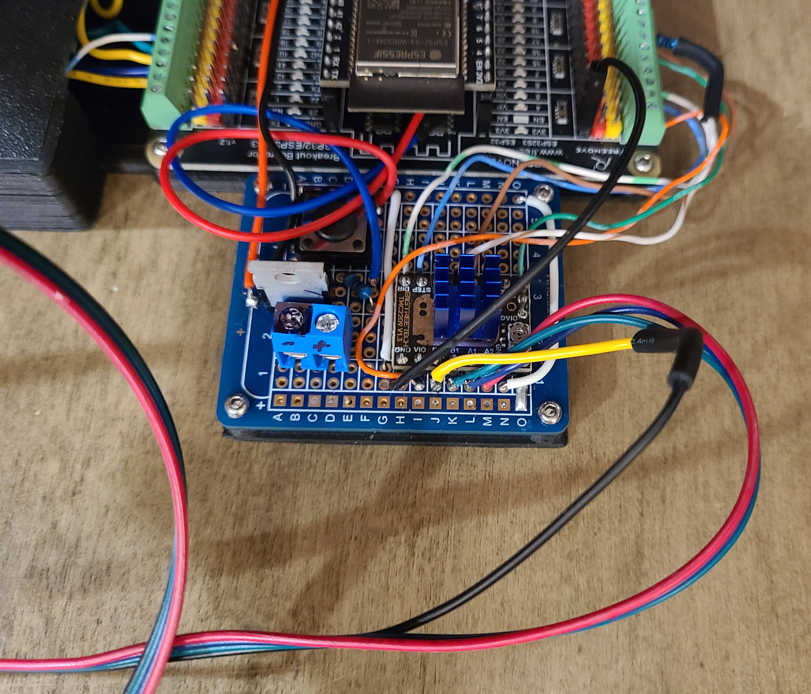
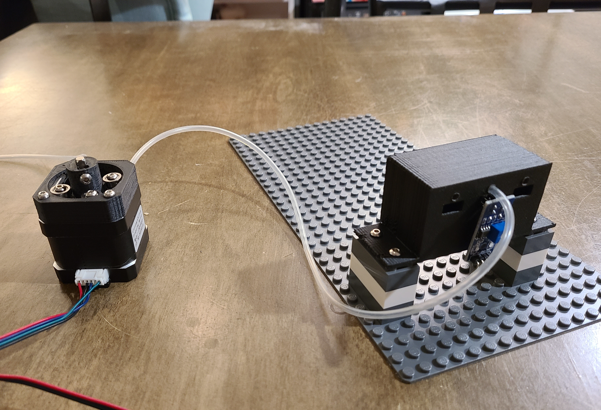
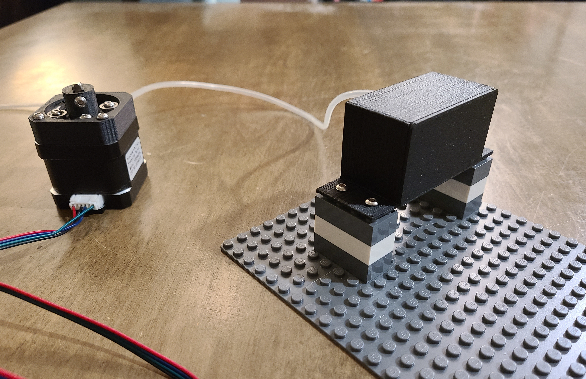
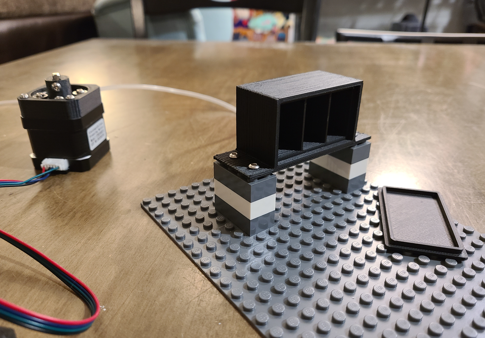
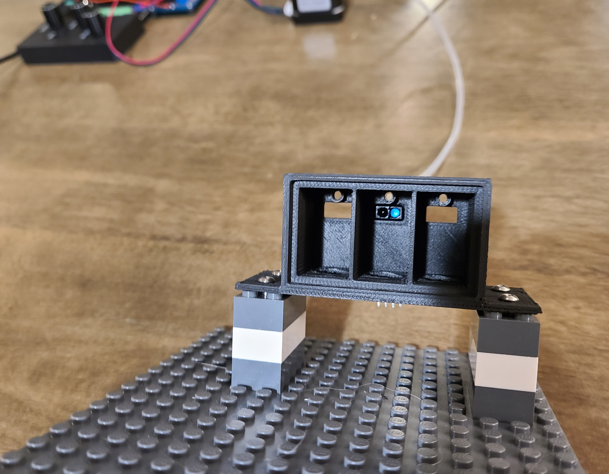

# Drip Prototyping Board

**WARNING --** A bug was found in the original script that causes the Auto button to not work after holding and releasing the Manual knob.  Update to the latest version, or as a workaround, make a manual adjustment by *turning* the Manual knob before pressing the Auto button.

This project uses an **ESP32-S3 WROOM (Freenove board)** with a **TMC2209 stepper driver**, to test using a peristaltic pump to create drips with precise timing.

---

## Features

* Adjust speed and distance for single "auto" drip, then press Auto button.  Ideally, this button will drop a single drip and prep the next drip.
* Manually move stepper motor forward or back to prep the next drip test (press Manual knob to run forward until released)

---

## Hardware Used

* [Freenove ESP32-S3 WROOM Board](https://github.com/Freenove/Freenove_ESP32_S3_WROOM)
* [TMC2209 Stepper Driver](https://www.trinamic.com/products/integrated-circuits/details/tmc2209/)
* NEMA 17 Stepper Motor (or similar)
* Rotary encoders (jog wheel with push button)
* Push button for motor control

---

## Wiring Overview

| Component          | ESP32-S3 Pin |
| ------------------ | ------------ |
| Manual Knob A      | GPIO 1       |
| Manual Knob B      | GPIO 2       |
| Speed Knob A       | GPIO 42      |
| Speed Knob B       | GPIO 41      |
| Distance Knob A    | GPIO 48      |
| Distance Knob B    | GPIO 47      |
| Auto Button        | GPIO 21      |
| Driver - Step      | GPIO 4       |
| Driver - Direction | GPIO 5       |
| Driver - Enable    | GPIO 15      |
| Driver - RX        | GPIO 16      |
| Driver - RX        | GPIO 17      |


---

## Usage

1. Rotate or Hold the Manual Knob → Stepper moves relative to rotation - Prep a drop
2. Adjust Speed and Distance encoder knobs as desired
3. Press Auto button → Stepper runs selected Distance at selected Speed

Serial Monitor output will confirm encoder and button activity.

Values are stored in the ESP32's memory, so testing can be done without a computer and later plugged into a serial monitor to read Speed/Distance values.

---

## Installation

### Prerequisites

* [PlatformIO](https://platformio.org/) inside VS Code
* Git installed

### Clone & Build

```bash
git clone https://github.com/YOUR-USERNAME/esp32-s3-stepper-controller.git
cd esp32-s3-stepper-controller
platformio run --target upload
```

### Serial Monitor

```bash
platformio device monitor
```

---

## Images



Here is the wiring for the stepper motor.  These connections are more fragile than I expected...

---

## Next Steps

* 🔲 Try IR drip sensor to auto prep a drip
* 🔲 Test with smaller/cheaper servos


**Back of drip detector prototype** The drip hose goes above an IR distance sensor.


**Front of drip detector with cover on** Cover blocks light from the IR sensors.


**Front of drip detector with cover off** 


**Front, inside view of drop detector** 
---

## License

MIT License — free to use and modify.
